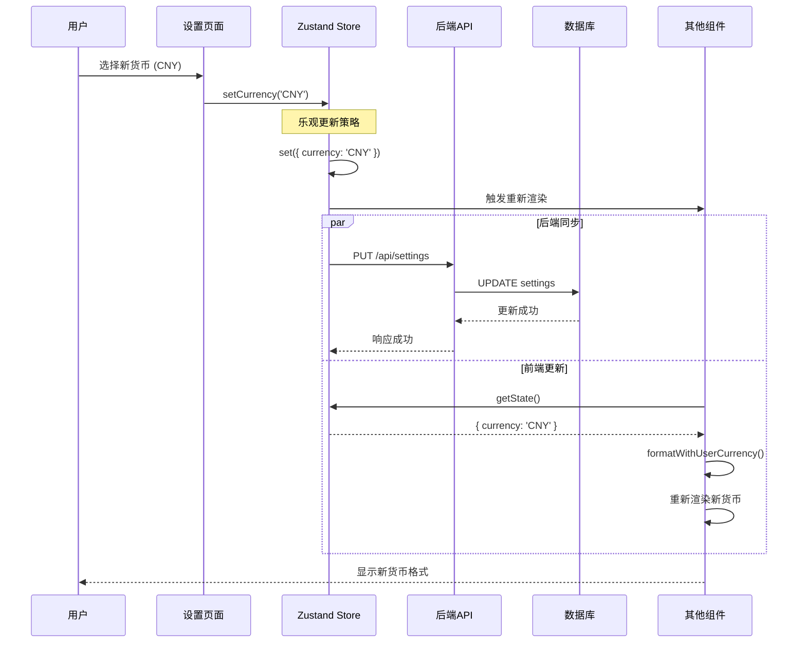

# 货币系统架构与前端展示流程详解

## 📋 目录

- [1. 系统概述](#1-系统概述)
- [2. 核心架构设计](#2-核心架构设计)
- [3. 前端货币展示流程](#3-前端货币展示流程)
- [4. 用户货币设置更新流程](#4-用户货币设置更新流程)
- [5. 技术实现细节](#5-技术实现细节)
- [6. 最佳实践与优化](#6-最佳实践与优化)

## 1. 系统概述

### 1.1 功能特性

订阅管理系统的货币功能提供以下核心特性：

- **多货币支持**：支持 7 种主要货币（USD, EUR, GBP, CAD, AUD, JPY, CNY）
- **实时汇率更新**：集成天行数据API，每日自动更新汇率
- **用户首选货币**：用户可设置默认显示货币
- **智能货币转换**：自动将所有金额转换为用户首选货币
- **双货币显示**：可选择同时显示转换后货币和原始货币
- **响应式更新**：货币设置变更时所有界面实时更新

### 1.2 技术栈

- **前端**：React + TypeScript + Zustand
- **后端**：Node.js + SQLite + Express
- **汇率API**：天行数据API (tianapi.com)
- **调度**：node-cron 定时任务
- **状态管理**：Zustand + persist 中间件

## 2. 核心架构设计

### 2.1 数据存储架构

#### 2.1.1 数据库设计

```sql
-- 用户设置表
CREATE TABLE settings (
    id INTEGER PRIMARY KEY CHECK (id = 1),
    currency TEXT NOT NULL DEFAULT 'CNY',  -- 用户默认货币
    theme TEXT NOT NULL DEFAULT 'system',
    created_at DATETIME DEFAULT CURRENT_TIMESTAMP,
    updated_at DATETIME DEFAULT CURRENT_TIMESTAMP
);

-- 汇率表
CREATE TABLE exchange_rates (
    id INTEGER PRIMARY KEY AUTOINCREMENT,
    from_currency TEXT NOT NULL,           -- 源货币（固定为CNY）
    to_currency TEXT NOT NULL,             -- 目标货币
    rate DECIMAL(15, 8) NOT NULL,          -- 汇率值
    created_at DATETIME DEFAULT CURRENT_TIMESTAMP,
    updated_at DATETIME DEFAULT CURRENT_TIMESTAMP,
    UNIQUE(from_currency, to_currency)
);

-- 订阅表
CREATE TABLE subscriptions (
    -- ...
    amount DECIMAL(10, 2) NOT NULL,        -- 订阅金额
    currency TEXT NOT NULL DEFAULT 'CNY', -- 订阅原始货币
    -- ...
);
```

#### 2.1.2 汇率数据结构

**后端存储格式**（数据库）：
```json
[
  { "from_currency": "USD", "to_currency": "USD", "rate": 1.0000 },
  { "from_currency": "USD", "to_currency": "EUR", "rate": 0.8500 },
  { "from_currency": "USD", "to_currency": "GBP", "rate": 0.7500 },
  { "from_currency": "USD", "to_currency": "CNY", "rate": 7.2400 }
]
```

**前端状态格式**（Zustand Store）：
```typescript
{
  exchangeRates: {
    USD: 1,
    EUR: 0.85,
    GBP: 0.75,
    CNY: 7.24
  }
}
```

### 2.2 货币配置中心化

```javascript
// server/config/currencies.js
const SUPPORTED_CURRENCY_CODES = ['USD', 'EUR', 'GBP', 'CAD', 'AUD', 'JPY', 'CNY'];

const SUPPORTED_CURRENCIES = [
    { code: 'USD', name: 'US Dollar', symbol: '$' },
    { code: 'EUR', name: 'Euro', symbol: '€' },
    { code: 'GBP', name: 'British Pound', symbol: '£' },
    { code: 'CAD', name: 'Canadian Dollar', symbol: 'C$' },
    { code: 'AUD', name: 'Australian Dollar', symbol: 'A$' },
    { code: 'JPY', name: 'Japanese Yen', symbol: '¥' },
    { code: 'CNY', name: 'Chinese Yuan', symbol: '¥' }
];
```

**设计优势**：
- 集中管理所有货币配置
- 避免在多个文件中重复定义
- 便于添加新货币支持
- 确保前后端货币列表一致

### 2.3 汇率更新机制

#### 2.3.1 自动调度更新

```javascript
// server/services/exchangeRateScheduler.js
class ExchangeRateScheduler {
    start() {
        // 每天凌晨2点执行汇率更新
        this.task = cron.schedule('0 2 * * *', async () => {
            await this.updateExchangeRates();
        }, {
            timezone: 'Asia/Shanghai'
        });
    }
    
    async updateExchangeRates() {
        // 从天行数据API获取最新汇率
        const rates = await this.exchangeRateService.getAllExchangeRates();
        // 批量更新数据库
        this.updateRatesInDatabase(rates);
    }
}
```

#### 2.3.2 手动更新接口

```typescript
// 前端手动触发更新
const updateRates = async () => {
  const result = await ExchangeRateApi.updateRates(apiKey);
  await fetchExchangeRates(); // 重新获取最新汇率
};
```

## 3. 前端货币展示流程

### 3.1 状态管理架构

#### 3.1.1 Zustand Store 设计

```typescript
interface SettingsState {
  // 用户设置
  currency: CurrencyType                    // 用户默认货币
  setCurrency: (currency: CurrencyType) => Promise<void>
  
  // 汇率数据
  exchangeRates: Record<string, number>     // 汇率对象
  fetchExchangeRates: () => Promise<void>   // 获取汇率
  lastExchangeRateUpdate: string | null     // 最后更新时间
  
  // 显示设置
  showOriginalCurrency: boolean             // 是否显示原始货币
  setShowOriginalCurrency: (show: boolean) => void
}
```

#### 3.1.2 状态初始化

```typescript
export const initialSettings = {
  currency: 'CNY' as CurrencyType,
  exchangeRates: {
    CNY: 1,      // 基准货币
    USD: 0.1538, // 1 CNY = 0.1538 USD
    EUR: 0.1308, // 1 CNY = 0.1308 EUR
    GBP: 0.1154, // 1 CNY = 0.1154 GBP
    CAD: 0.1923, // 1 CNY = 0.1923 CAD
    AUD: 0.2077, // 1 CNY = 0.2077 AUD
    JPY: 16.9231 // 1 CNY = 16.9231 JPY
  },
  showOriginalCurrency: true,
}
```

### 3.2 核心转换函数

#### 3.2.1 基础货币转换

```typescript
// src/utils/currency.ts
export function convertCurrency(
  amount: number,
  fromCurrency: string,
  toCurrency: string,
): number {
  const { exchangeRates } = useSettingsStore.getState()
  
  // 相同货币无需转换
  if (fromCurrency === toCurrency) {
    return amount
  }
  
  // 检查汇率数据完整性
  if (!exchangeRates[fromCurrency] || !exchangeRates[toCurrency]) {
    console.warn(`Missing exchange rate for ${fromCurrency} or ${toCurrency}`)
    return amount
  }
  
  // 通过CNY作为中介货币进行两步转换
  // 步骤1: 源货币 → CNY
  const cnyAmount = amount / exchangeRates[fromCurrency]
  // 步骤2: CNY → 目标货币
  return cnyAmount * exchangeRates[toCurrency]
}
```

**转换示例**：
```
100 USD → EUR
步骤1: 100 / 0.1538 = 650.19 CNY
步骤2: 650.19 * 0.1308 = 85.08 EUR
```

#### 3.2.2 货币格式化

```typescript
export function formatCurrencyAmount(
  amount: number, 
  currency: string,
  showSymbol: boolean = true
): string {
  // 获取货币符号
  const symbol = showSymbol ? (currencySymbols[currency] || currency) : ''
  
  // 日元特殊处理（无小数位）
  const formatter = new Intl.NumberFormat('en-US', {
    minimumFractionDigits: currency === 'JPY' ? 0 : 2,
    maximumFractionDigits: currency === 'JPY' ? 0 : 2
  })
  
  const formattedAmount = formatter.format(amount)
  return symbol + formattedAmount
}
```

#### 3.2.3 智能货币显示

```typescript
export function formatWithUserCurrency(
  amount: number,
  originalCurrency: string,
  showOriginal: boolean = true
): string {
  const { currency: userCurrency, showOriginalCurrency } = useSettingsStore.getState()
  
  // 转换到用户首选货币
  const convertedAmount = convertCurrency(amount, originalCurrency, userCurrency)
  const formattedConverted = formatCurrencyAmount(convertedAmount, userCurrency)
  
  // 决定显示格式
  if (originalCurrency === userCurrency || (!showOriginal && !showOriginalCurrency)) {
    return formattedConverted  // 只显示转换后货币
  }
  
  // 双货币显示
  const formattedOriginal = formatCurrencyAmount(amount, originalCurrency)
  return `${formattedConverted} (${formattedOriginal})`
}
```

**显示效果示例**：
- 货币相同：`$9.99`
- 货币不同：`¥72.33 ($9.99)`
- 关闭原始显示：`¥72.33`

### 3.3 组件集成应用

#### 3.3.1 订阅卡片组件

```typescript
// src/components/subscription/SubscriptionCard.tsx
export function SubscriptionCard({ subscription }: SubscriptionCardProps) {
  const { amount, currency } = subscription
  
  return (
    <Card>
      <CardContent>
        <div className="font-medium">
          {formatWithUserCurrency(amount, currency)}
        </div>
      </CardContent>
    </Card>
  )
}
```

#### 3.3.2 货币选择器组件

```typescript
// src/components/subscription/CurrencySelector.tsx
export function CurrencySelector({ value, onValueChange }: CurrencySelectorProps) {
  const { exchangeRates, fetchExchangeRates } = useSettingsStore()

  // 基于可用汇率生成货币列表
  const currencies = Object.keys(exchangeRates).map((code) => ({
    value: code,
    label: `${code} - ${currencyNames[code] || code}`,
    symbol: currencySymbols[code] || code
  }))

  return (
    <Select value={value} onValueChange={onValueChange}>
      {currencies.map((currency) => (
        <SelectItem key={currency.value} value={currency.value}>
          <span className="flex items-center gap-2">
            <span className="w-6 text-center">{currency.symbol}</span>
            <span>{currency.label}</span>
          </span>
        </SelectItem>
      ))}
    </Select>
  )
}
```

## 4. 用户货币设置更新流程

### 4.1 完整更新流程概览



### 4.2 用户操作起点

#### 4.2.1 设置页面交互

```typescript
// src/components/ExchangeRateManager.tsx
export function ExchangeRateManager() {
  const { currency, setCurrency, exchangeRates } = useSettingsStore();

  return (
    <Card>
      <CardContent>
        <Label htmlFor="currency">Default Currency</Label>
        <Select
          value={currency}
          onValueChange={async (value: CurrencyType) => await setCurrency(value)}
        >
          <SelectTrigger>
            <SelectValue placeholder="Select a currency" />
          </SelectTrigger>
          <SelectContent>
            {Object.keys(exchangeRates).map((currencyCode) => (
              <SelectItem key={currencyCode} value={currencyCode}>
                <span className="flex items-center gap-2">
                  <span className="w-6 text-center">
                    {currencySymbols[currencyCode]}
                  </span>
                  <span>{currencyCode} - {currencyNames[currencyCode]}</span>
                </span>
              </SelectItem>
            ))}
          </SelectContent>
        </Select>
      </CardContent>
    </Card>
  )
}
```

**用户操作步骤**：
1. 用户进入设置页面，点击 "Currency" 标签
2. 看到当前默认货币的下拉选择框
3. 点击下拉框，显示所有可用货币列表
4. 选择新货币（如从 USD 改为 CNY）
5. 触发 `onValueChange` 事件，调用 `setCurrency(value)`

### 4.3 setCurrency 函数执行

#### 4.3.1 前端状态更新

```typescript
// src/store/settingsStore.ts
setCurrency: async (currency) => {
  // 第一步：立即更新本地状态（乐观更新）
  set({ currency })

  // 第二步：同步到后端
  try {
    const response = await fetch(`${API_BASE_URL}/settings`, {
      method: 'PUT',
      headers: getHeaders(),  // 包含API密钥
      body: JSON.stringify({ currency })
    })

    if (!response.ok) {
      logger.error('Failed to save currency setting to backend')
      // 可选：回滚本地更改
    }
  } catch (error) {
    logger.error('Error saving currency setting:', error)
    // 可选：回滚本地更改
  }
}
```

**乐观更新策略优势**：
- 用户立即看到界面变化，无需等待网络请求
- 提升用户体验，减少感知延迟
- 后端同步异步进行，不阻塞用户操作

#### 4.3.2 后端处理逻辑

```javascript
// server/controllers/settingsController.js
updateSettings = asyncHandler(async (req, res) => {
    const { currency, theme } = req.body;

    // 数据验证
    const validator = createValidator();
    if (currency !== undefined) {
        validator
            .string(currency, 'currency')
            .length(currency, 'currency', 3, 3)
            .custom(currency, 'currency',
                (value) => this.settingsService.validateCurrency(value),
                'Invalid currency code'
            );
    }

    if (validator.hasErrors()) {
        return validationError(res, validator.getErrors());
    }

    // 准备更新数据
    const updateData = {};
    if (currency !== undefined) updateData.currency = currency.toUpperCase();

    // 执行数据库更新
    const result = await this.settingsService.updateSettings(updateData);
    handleDbResult(res, result, 'update', 'Settings');
});
```

**后端处理步骤**：
1. 接收 PUT 请求到 `/api/settings`
2. 验证货币代码格式和有效性
3. 调用 `settingsService.updateSettings()` 更新数据库
4. 返回更新成功响应

### 4.4 组件自动重新渲染

#### 4.4.1 Zustand 响应式机制

```typescript
// Zustand 内部机制简化版
const listeners = new Set()  // 存储所有订阅的组件

function set(partial) {
  state = { ...state, ...partial }  // 更新状态
  listeners.forEach(listener => listener())  // 通知所有订阅者重新渲染
}

// 组件订阅机制
function useSettingsStore() {
  const [, forceUpdate] = useReducer(x => x + 1, 0)

  useEffect(() => {
    listeners.add(forceUpdate)  // 注册监听器
    return () => listeners.delete(forceUpdate)  // 清理监听器
  }, [])

  return state
}
```

#### 4.4.2 组件重新渲染过程

```typescript
// 订阅卡片组件重新渲染
export function SubscriptionCard({ subscription }) {
  const { amount, currency } = subscription  // 订阅数据不变

  // 当 setCurrency 执行后，这个组件函数会重新执行
  // formatWithUserCurrency 内部调用 useSettingsStore.getState()
  // 获取到最新的用户货币设置
  return (
    <div className="font-medium">
      {formatWithUserCurrency(amount, currency)}
    </div>
  )
}
```

### 4.5 显示内容自动切换

#### 4.5.1 货币转换计算示例

假设用户有一个 Netflix 订阅（$9.99 USD），从 CNY 切换到 USD：

**切换前显示**：
```
¥65.00
```

**切换后计算过程**：

```typescript
// formatWithUserCurrency(65.00, 'CNY') 重新执行
const { currency: userCurrency } = useSettingsStore.getState()  // 'USD'

// convertCurrency(65.00, 'CNY', 'USD')
const cnyAmount = 65.00 / exchangeRates['CNY']  // 65.00 / 1 = 65.00
const usdAmount = cnyAmount * exchangeRates['USD']  // 65.00 * 0.1538 = 9.99

// formatCurrencyAmount(9.99, 'USD')
const symbol = currencySymbols['USD']  // '$'
const formattedAmount = new Intl.NumberFormat('en-US', {
  minimumFractionDigits: 2,
  maximumFractionDigits: 2
}).format(9.99)  // '9.99'

// 最终结果
return '¥' + '72.33'  // '¥72.33'
```

**切换后显示**：
```
¥72.33 ($9.99)  // 如果启用双货币显示
```

#### 4.5.2 多组件同时更新效果

当用户更改货币设置时，所有相关组件会同时更新：

**Dashboard 页面**：
- 总支出：`$156.78` → `¥1,135.11 ($156.78)`
- 月度平均：`$13.07` → `¥94.59 ($13.07)`
- 年度预估：`$1,881.36` → `¥13,621.25 ($1,881.36)`

**订阅列表页面**：
- Netflix：`$9.99` → `¥72.33 ($9.99)`
- Spotify：`$12.99` → `¥94.05 ($12.99)`
- Adobe Creative Cloud：`$52.99` → `¥383.65 ($52.99)`

**报表页面**：
- 图表数据自动重新计算和渲染
- 所有金额轴标签切换到新货币
- 趋势分析数据保持一致性

## 5. 技术实现细节

### 5.1 汇率数据同步机制

#### 5.1.1 前端汇率获取

```typescript
// src/store/settingsStore.ts
fetchExchangeRates: async () => {
  try {
    const response = await fetch(`${API_BASE_URL}/exchange-rates`)
    if (!response.ok) {
      throw new Error('Failed to fetch exchange rates')
    }

    const rates = await response.json()

    // 转换后端数组格式为前端对象格式
    const ratesMap: Record<string, number> = {}
    if (rates.success && Array.isArray(rates.data)) {
      rates.data.forEach((rate: any) => {
        if (rate.from_currency === 'CNY') {
          ratesMap[rate.to_currency] = rate.rate
        }
      })
      ratesMap['CNY'] = 1  // 确保CNY基准汇率
    }

    set({
      exchangeRates: ratesMap,
      lastExchangeRateUpdate: new Date().toISOString()
    })
  } catch (error) {
    logger.error('Failed to fetch exchange rates:', error)
  }
}
```

#### 5.1.2 汇率数据格式转换

**后端API响应格式**：
```json
{
  "success": true,
  "data": [
    { "from_currency": "USD", "to_currency": "USD", "rate": 1.0000 },
    { "from_currency": "USD", "to_currency": "EUR", "rate": 0.8500 },
    { "from_currency": "USD", "to_currency": "CNY", "rate": 7.2400 }
  ]
}
```

**前端状态格式**：
```typescript
{
  exchangeRates: {
    USD: 1.0000,
    EUR: 0.8500,
    CNY: 7.2400
  }
}
```

### 5.2 费用计算中的货币处理

#### 5.2.1 月度费用计算

```typescript
// src/lib/expense-analytics.ts
export function calculateMonthlyAmount(
  subscription: Subscription,
  targetCurrency: string
): number {
  // 首先进行货币转换
  const convertedAmount = convertCurrency(
    subscription.amount,
    subscription.currency,
    targetCurrency
  )

  // 然后根据计费周期标准化为月度金额
  switch (subscription.billingCycle) {
    case 'monthly':
      return convertedAmount
    case 'yearly':
      return convertedAmount / 12    // 年费平摊到月
    case 'quarterly':
      return convertedAmount / 3     // 季费平摊到月
    default:
      return convertedAmount
  }
}
```

**计算逻辑说明**：
1. **货币转换优先**：先统一货币单位
2. **周期标准化**：再进行时间周期转换
3. **精度保持**：使用浮点数保持计算精度

#### 5.2.2 报表数据转换

```typescript
// src/lib/expense-analytics-api.ts
export function transformMonthlyCategorySummaries(
  summariesResponse: MonthlyCategorySummariesResponse,
  targetCurrency: string = 'CNY'
): MonthlyExpense[] {
  const monthlyMap = new Map<string, { amount: number; transactionCount: number }>();

  summariesResponse.summaries.forEach(summary => {
    const monthKey = summary.monthKey;

    // 将后端CNY数据转换为用户目标货币
    const convertedAmount = convertCurrency(summary.totalAmount, 'CNY', targetCurrency);

    if (!monthlyMap.has(monthKey)) {
      monthlyMap.set(monthKey, { amount: 0, transactionCount: 0 });
    }

    const monthData = monthlyMap.get(monthKey)!;
    monthData.amount += convertedAmount;
    monthData.transactionCount += summary.transactionsCount;
  });

  // 转换为图表组件需要的格式
  return Array.from(monthlyMap.entries()).map(([monthKey, data]) => ({
    monthKey,
    amount: data.amount,
    subscriptionCount: data.transactionCount
  }));
}
```

### 5.3 错误处理与容错机制

#### 5.3.1 汇率缺失处理

```typescript
export function convertCurrency(
  amount: number,
  fromCurrency: string,
  toCurrency: string,
): number {
  const { exchangeRates } = useSettingsStore.getState()

  // 容错处理：汇率数据缺失时返回原金额
  if (!exchangeRates[fromCurrency] || !exchangeRates[toCurrency]) {
    console.warn(`Missing exchange rate for ${fromCurrency} or ${toCurrency}`)
    return amount  // 降级处理，显示原金额
  }

  // 正常转换逻辑
  const cnyAmount = amount / exchangeRates[fromCurrency]
  return cnyAmount * exchangeRates[toCurrency]
}
```

#### 5.3.2 网络请求失败处理

```typescript
setCurrency: async (currency) => {
  const previousCurrency = get().currency

  // 乐观更新
  set({ currency })

  try {
    const response = await fetch(`${API_BASE_URL}/settings`, {
      method: 'PUT',
      headers: getHeaders(),
      body: JSON.stringify({ currency })
    })

    if (!response.ok) {
      // 回滚本地状态
      set({ currency: previousCurrency })
      throw new Error('Failed to update currency setting')
    }
  } catch (error) {
    // 回滚本地状态
    set({ currency: previousCurrency })
    logger.error('Error saving currency setting:', error)
    throw error
  }
}
```

### 5.4 性能优化策略

#### 5.4.1 组件渲染优化

```typescript
// 使用 React.memo 优化订阅卡片渲染
export const SubscriptionCard = React.memo(({ subscription }: SubscriptionCardProps) => {
  const { amount, currency } = subscription

  return (
    <Card>
      <CardContent>
        <div className="font-medium">
          {formatWithUserCurrency(amount, currency)}
        </div>
      </CardContent>
    </Card>
  )
}, (prevProps, nextProps) => {
  // 只有订阅数据变化时才重新渲染
  return prevProps.subscription.id === nextProps.subscription.id &&
         prevProps.subscription.amount === nextProps.subscription.amount &&
         prevProps.subscription.currency === nextProps.subscription.currency
})
```

#### 5.4.2 状态选择器优化

```typescript
// 使用选择器避免不必要的重新渲染
const useCurrencySettings = () => {
  return useSettingsStore(
    useCallback(
      (state) => ({
        currency: state.currency,
        exchangeRates: state.exchangeRates,
        showOriginalCurrency: state.showOriginalCurrency
      }),
      []
    )
  )
}
```

## 6. 最佳实践与优化

### 6.1 代码组织最佳实践

#### 6.1.1 功能模块化

```
src/
├── utils/
│   └── currency.ts           # 货币转换核心函数
├── store/
│   └── settingsStore.ts      # 设置状态管理
├── components/
│   ├── subscription/
│   │   └── CurrencySelector.tsx  # 货币选择组件
│   └── ExchangeRateManager.tsx   # 汇率管理组件
├── services/
│   └── exchangeRateApi.ts    # 汇率API服务
└── lib/
    └── expense-analytics.ts  # 费用计算逻辑
```

#### 6.1.2 类型定义统一

```typescript
// src/types/currency.ts
export type CurrencyType = 'USD' | 'EUR' | 'GBP' | 'CAD' | 'AUD' | 'JPY' | 'CNY'

export interface ExchangeRate {
  id: number
  from_currency: string
  to_currency: string
  rate: number
  created_at: string
  updated_at: string
}

export interface CurrencyInfo {
  code: string
  name: string
  symbol: string
}
```

### 6.2 用户体验优化

#### 6.2.1 加载状态处理

```typescript
export function ExchangeRateManager() {
  const [isUpdating, setIsUpdating] = useState(false)
  const { updateExchangeRatesFromApi } = useSettingsStore()

  const handleUpdateRates = async () => {
    setIsUpdating(true)
    try {
      await updateExchangeRatesFromApi()
      toast.success('Exchange rates updated successfully')
    } catch (error) {
      toast.error('Failed to update exchange rates')
    } finally {
      setIsUpdating(false)
    }
  }

  return (
    <Button
      onClick={handleUpdateRates}
      disabled={isUpdating}
    >
      {isUpdating ? (
        <>
          <Loader2 className="mr-2 h-4 w-4 animate-spin" />
          Updating...
        </>
      ) : (
        'Update Rates'
      )}
    </Button>
  )
}
```

#### 6.2.2 错误提示优化

```typescript
const setCurrency = async (currency: CurrencyType) => {
  try {
    await settingsStore.setCurrency(currency)
    toast.success(`Default currency changed to ${currency}`)
  } catch (error) {
    toast.error('Failed to update currency setting. Please try again.')
  }
}
```

### 6.3 数据一致性保证

#### 6.3.1 状态同步策略

```typescript
// 定期同步汇率数据
useEffect(() => {
  const syncExchangeRates = async () => {
    const lastUpdate = lastExchangeRateUpdate
    const now = new Date()
    const lastUpdateDate = lastUpdate ? new Date(lastUpdate) : null

    // 如果超过24小时未更新，自动获取最新汇率
    if (!lastUpdateDate || (now.getTime() - lastUpdateDate.getTime()) > 24 * 60 * 60 * 1000) {
      await fetchExchangeRates()
    }
  }

  syncExchangeRates()
}, [])
```

#### 6.3.2 数据验证机制

```typescript
// 汇率数据有效性验证
const validateExchangeRates = (rates: Record<string, number>): boolean => {
  // 检查必需的货币
  const requiredCurrencies = ['USD', 'EUR', 'GBP', 'CNY']
  const hasAllRequired = requiredCurrencies.every(currency =>
    rates[currency] && rates[currency] > 0
  )

  // 检查USD基准汇率
  const hasUSDBase = rates['USD'] === 1

  return hasAllRequired && hasUSDBase
}
```

### 6.4 监控与调试

#### 6.4.1 货币转换日志

```typescript
export function convertCurrency(
  amount: number,
  fromCurrency: string,
  toCurrency: string,
): number {
  const { exchangeRates } = useSettingsStore.getState()

  if (process.env.NODE_ENV === 'development') {
    console.log(`Converting ${amount} ${fromCurrency} to ${toCurrency}`, {
      fromRate: exchangeRates[fromCurrency],
      toRate: exchangeRates[toCurrency]
    })
  }

  // 转换逻辑...
  const result = usdAmount * exchangeRates[toCurrency]

  if (process.env.NODE_ENV === 'development') {
    console.log(`Conversion result: ${result} ${toCurrency}`)
  }

  return result
}
```

#### 6.4.2 性能监控

```typescript
// 监控货币转换性能
const performanceMonitor = {
  startTime: 0,

  start() {
    this.startTime = performance.now()
  },

  end(operation: string) {
    const duration = performance.now() - this.startTime
    if (duration > 10) {  // 超过10ms记录警告
      console.warn(`Slow currency operation: ${operation} took ${duration.toFixed(2)}ms`)
    }
  }
}
```

## 7. 总结

### 7.1 系统优势

1. **响应式设计**：用户操作立即反馈，无需等待
2. **数据一致性**：前后端状态同步，确保数据准确
3. **容错机制**：网络失败时优雅降级，不影响用户体验
4. **性能优化**：智能渲染，避免不必要的计算和更新
5. **可维护性**：模块化设计，代码清晰易于扩展

### 7.2 技术特点

- **乐观更新**：提升用户体验的关键策略
- **中介货币**：简化多货币转换的设计模式
- **状态管理**：Zustand 提供高效的响应式状态
- **类型安全**：TypeScript 确保代码质量
- **错误处理**：完善的容错和回滚机制

### 7.3 扩展方向

1. **更多货币支持**：添加新的货币类型
2. **历史汇率**：支持查看汇率变化趋势
3. **自定义汇率**：允许用户手动设置汇率
4. **离线支持**：缓存汇率数据支持离线使用
5. **实时更新**：WebSocket 实时推送汇率变化

这套货币系统为订阅管理应用提供了完整、可靠、用户友好的多货币支持，是现代Web应用中货币处理的最佳实践示例。
