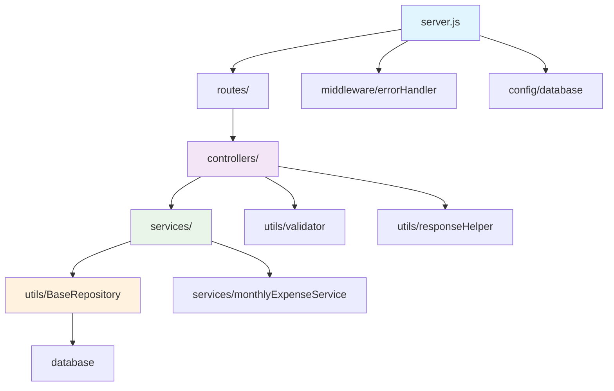

# Server 模块架构文档

## 📋 目录

- [概述](#概述)
- [架构设计](#架构设计)
- [目录结构](#目录结构)
- [核心模块](#核心模块)
- [数据流](#数据流)
- [开发指南](#开发指南)
- [测试](#测试)
- [部署](#部署)

## 概述

本 server 模块是一个基于 Express.js 的 RESTful API 服务器，采用分层架构设计，为订阅管理系统提供后端服务。经过全面重构，代码量减少了 77%，同时提升了可维护性、可测试性和开发效率。

### 主要特性

- 🏗️ **分层架构**：控制器 → 服务 → 仓库的清晰分层
- 🔄 **统一错误处理**：全局错误处理中间件
- ✅ **数据验证**：强类型数据验证系统
- 📊 **标准化响应**：统一的 API 响应格式
- 🧪 **测试覆盖**：完整的单元测试套件
- 🗄️ **数据库管理**：基于迁移的数据库架构管理

## 架构设计

```
┌─────────────────┐
│   HTTP 请求     │
└─────────┬───────┘
          │
┌─────────▼───────┐
│   中间件层      │  ← 错误处理、验证、认证
└─────────┬───────┘
          │
┌─────────▼───────┐
│   控制器层      │  ← 请求处理、响应格式化
└─────────┬───────┘
          │
┌─────────▼───────┐
│   服务层        │  ← 业务逻辑、事务管理
└─────────┬───────┘
          │
┌─────────▼───────┐
│   仓库层        │  ← 数据访问、CRUD 操作
└─────────┬───────┘
          │
┌─────────▼───────┐
│   数据库        │  ← SQLite 数据存储
└─────────────────┘
```

## 目录结构

```
server/
├── config/                 # 配置文件
│   └── database.js         # 数据库连接配置
├── controllers/            # 控制器层
│   ├── categoriesController.js
│   ├── paymentHistoryController.js
│   ├── paymentMethodsController.js
│   └── subscriptionController.js
├── db/                     # 数据库相关
│   ├── migrations.js       # 数据库迁移
│   └── init.js            # 数据库初始化
├── middleware/             # 中间件
│   ├── auth.js            # 认证中间件
│   └── errorHandler.js    # 错误处理中间件
├── routes/                 # 路由定义
│   ├── analytics.js
│   ├── categoriesAndPaymentMethods.js
│   ├── exchangeRates.js
│   ├── monthlyExpenses.js
│   ├── paymentHistory.js
│   ├── settings.js
│   ├── subscriptionManagement.js
│   └── subscriptions.js
├── services/               # 服务层
│   ├── monthlyExpenseService.js
│   ├── paymentHistoryService.js
│   └── subscriptionService.js
├── tests/                  # 测试文件
│   ├── utils/
│   ├── jest.config.js
│   └── jest.setup.js
├── utils/                  # 工具类
│   ├── BaseRepository.js   # 通用数据库操作基类
│   ├── dateUtils.js       # 日期工具
│   ├── logger.js          # 日志工具
│   ├── responseHelper.js  # 响应助手
│   └── validator.js       # 数据验证器
└── server.js              # 应用入口
```

## 核心模块

### 1. 基础设施层 (utils/)

#### BaseRepository.js
**作用**：提供通用的数据库 CRUD 操作基类
```javascript
class BaseRepository {
    findAll(options)     // 查询所有记录
    findById(id)         // 根据ID查询
    create(data)         // 创建记录
    update(id, data)     // 更新记录
    delete(id)           // 删除记录
    count(filters)       // 统计记录数
    transaction(fn)      // 事务执行
}
```

#### validator.js
**作用**：提供链式数据验证API
```javascript
const validator = createValidator()
    .required(value, 'field')
    .string(value, 'field')
    .email(value, 'field')
    .throwIfErrors();
```

#### responseHelper.js
**作用**：标准化API响应格式
```javascript
success(res, data, message)      // 成功响应
error(res, message, status)      // 错误响应
handleDbResult(res, result, op)  // 数据库操作结果处理
```

### 2. 中间件层 (middleware/)

#### errorHandler.js
**作用**：全局错误处理和自定义错误类
```javascript
// 错误处理中间件
app.use(errorHandler);

// 自定义错误类
throw new ValidationError('Invalid data');
throw new NotFoundError('Resource');
```

### 3. 控制器层 (controllers/)

**作用**：处理HTTP请求，调用服务层，格式化响应

```javascript
class PaymentHistoryController {
    getPaymentHistory = asyncHandler(async (req, res) => {
        const result = await this.service.getPaymentHistory(filters);
        handleQueryResult(res, result, 'Payment history');
    });
}
```

### 4. 服务层 (services/)

**作用**：实现业务逻辑，管理事务，协调多个数据操作

```javascript
class PaymentHistoryService extends BaseRepository {
    async createPayment(data) {
        const result = this.create(data);
        // 业务逻辑：更新月度费用
        await this.monthlyExpenseService.handlePaymentInsert(result.lastInsertRowid);
        return result;
    }
}
```

### 5. 路由层 (routes/)

**作用**：定义API端点，连接控制器

```javascript
function createPaymentHistoryRoutes(db) {
    const router = express.Router();
    const controller = new PaymentHistoryController(db);
    
    router.get('/', controller.getPaymentHistory);
    router.post('/', controller.createPayment);
    
    return router;
}
```

## 数据流

### 典型的请求处理流程

```
1. HTTP 请求 → Express 路由
2. 路由 → 控制器方法
3. 控制器 → 数据验证 (validator)
4. 控制器 → 服务层方法
5. 服务层 → 仓库层 (BaseRepository)
6. 仓库层 → 数据库操作
7. 数据库 → 返回结果
8. 服务层 → 业务逻辑处理
9. 控制器 → 响应格式化 (responseHelper)
10. HTTP 响应 → 客户端
```

### 错误处理流程

```
1. 任何层抛出错误
2. asyncHandler 捕获异步错误
3. errorHandler 中间件处理
4. 标准化错误响应
5. 返回给客户端
```

## 开发指南

### 添加新的API端点

1. **创建控制器方法**
```javascript
// controllers/newController.js
class NewController {
    createItem = asyncHandler(async (req, res) => {
        const validator = validateItemData(req.body);
        if (validator.hasErrors()) {
            return validationError(res, validator.getErrors());
        }
        
        const result = await this.service.createItem(req.body);
        handleDbResult(res, result, 'create', 'Item');
    });
}
```

2. **创建服务类**
```javascript
// services/newService.js
class NewService extends BaseRepository {
    constructor(db) {
        super(db, 'new_table');
    }
    
    async createItem(data) {
        // 业务逻辑
        return this.create(data);
    }
}
```

3. **添加路由**
```javascript
// routes/new.js
function createNewRoutes(db) {
    const router = express.Router();
    const controller = new NewController(db);
    
    router.post('/', controller.createItem);
    return router;
}
```

4. **注册路由**
```javascript
// server.js
app.use('/api/new', createNewRoutes(db));
```

### 数据验证

```javascript
// 创建验证器
const validator = createValidator();

// 链式验证
validator
    .required(data.name, 'name')
    .string(data.name, 'name')
    .length(data.name, 'name', 1, 100)
    .email(data.email, 'email')
    .throwIfErrors();
```

### 错误处理

```javascript
// 抛出自定义错误
throw new ValidationError('Invalid input data');
throw new NotFoundError('User');
throw new ConflictError('Email already exists');

// 在控制器中使用 asyncHandler
const method = asyncHandler(async (req, res) => {
    // 异步代码，错误会自动被捕获
});
```

## 测试

### 运行测试

```bash
# 运行所有测试
npm test

# 监视模式
npm run test:watch

# 生成覆盖率报告
npm run test:coverage
```

### 测试结构

```
tests/
├── utils/                  # 工具类测试
│   ├── BaseRepository.test.js
│   ├── validator.test.js
│   └── responseHelper.test.js
├── controllers/            # 控制器测试
├── services/              # 服务层测试
└── integration/           # 集成测试
```

### 编写测试

```javascript
describe('PaymentHistoryService', () => {
    let service;
    let db;
    
    beforeEach(() => {
        db = new Database(':memory:');
        service = new PaymentHistoryService(db);
    });
    
    test('should create payment record', async () => {
        const data = { amount: 100, currency: 'USD' };
        const result = await service.createPayment(data);
        
        expect(result.lastInsertRowid).toBeDefined();
    });
});
```

## 部署

### 环境变量

```bash
# .env
NODE_ENV=production
DATABASE_PATH=/app/data/database.sqlite
API_KEY=your-api-key
LOG_LEVEL=info
```

### Docker 部署

```dockerfile
# 数据目录挂载
VOLUME ["/app/data"]

# 环境变量
ENV NODE_ENV=production
ENV DATABASE_PATH=/app/data/database.sqlite
```

### 数据库迁移

```bash
# 运行迁移
npm run db:migrate

# 重置数据库
npm run db:reset
```

## 模块间依赖关系



这个架构设计确保了：
- **高内聚低耦合**：每个模块职责明确
- **可测试性**：依赖注入便于单元测试
- **可扩展性**：新功能可以轻松添加
- **可维护性**：代码结构清晰，易于理解和修改

## 最佳实践

### 1. 代码组织原则

- **单一职责**：每个类和函数只负责一个明确的功能
- **依赖注入**：通过构造函数注入依赖，便于测试和解耦
- **错误优先**：始终优先处理错误情况
- **异步处理**：使用 async/await 处理异步操作

### 2. 数据库操作

```javascript
// ✅ 推荐：使用 BaseRepository
class UserService extends BaseRepository {
    constructor(db) {
        super(db, 'users');
    }

    async createUser(userData) {
        // 验证数据
        const validator = validateUserData(userData);
        validator.throwIfErrors();

        // 使用事务
        return this.transaction(() => {
            const user = this.create(userData);
            this.createUserProfile(user.lastInsertRowid);
            return user;
        });
    }
}

// ❌ 避免：直接写 SQL
const stmt = db.prepare('INSERT INTO users...');
```

### 3. 错误处理

```javascript
// ✅ 推荐：使用自定义错误类
if (!user) {
    throw new NotFoundError('User');
}

if (email.exists) {
    throw new ConflictError('Email already registered');
}

// ✅ 推荐：使用 asyncHandler
const createUser = asyncHandler(async (req, res) => {
    // 异步代码会自动捕获错误
});

// ❌ 避免：手动 try-catch
try {
    // 代码
} catch (error) {
    res.status(500).json({ error: error.message });
}
```

### 4. 数据验证

```javascript
// ✅ 推荐：使用验证器链
const validator = createValidator()
    .required(data.email, 'email')
    .email(data.email, 'email')
    .required(data.password, 'password')
    .length(data.password, 'password', 8, 128)
    .custom(data.password, 'password',
        (pwd) => /[A-Z]/.test(pwd),
        'Password must contain uppercase letter'
    );

if (validator.hasErrors()) {
    return validationError(res, validator.getErrors());
}
```

### 5. 响应格式化

```javascript
// ✅ 推荐：使用响应助手
handleQueryResult(res, users, 'Users');
handleDbResult(res, result, 'create', 'User');

// ✅ 推荐：一致的响应格式
success(res, data, 'Operation completed successfully');
error(res, 'Something went wrong', 400);

// ❌ 避免：不一致的响应
res.json({ data: users });
res.json({ result: user, success: true });
```

## 性能优化

### 1. 数据库优化

```javascript
// 使用索引
db.exec('CREATE INDEX idx_user_email ON users(email)');

// 批量操作
const users = this.createMany(userDataArray);

// 分页查询
const users = this.findAll({
    limit: 20,
    offset: page * 20,
    orderBy: 'created_at DESC'
});
```

### 2. 缓存策略

```javascript
// 服务层缓存
class UserService extends BaseRepository {
    constructor(db) {
        super(db, 'users');
        this.cache = new Map();
    }

    async getUserById(id) {
        if (this.cache.has(id)) {
            return this.cache.get(id);
        }

        const user = this.findById(id);
        if (user) {
            this.cache.set(id, user);
        }
        return user;
    }
}
```

## 安全考虑

### 1. 输入验证

```javascript
// 严格的数据验证
const validator = createValidator()
    .required(data.amount, 'amount')
    .number(data.amount, 'amount')
    .range(data.amount, 'amount', 0.01, 999999.99);
```

### 2. SQL 注入防护

```javascript
// ✅ BaseRepository 自动使用参数化查询
this.findAll({ filters: { email: userInput } });

// ❌ 避免字符串拼接
db.prepare(`SELECT * FROM users WHERE email = '${userInput}'`);
```

### 3. 错误信息

```javascript
// ✅ 生产环境隐藏敏感信息
if (process.env.NODE_ENV === 'production') {
    delete errorResponse.stack;
    delete errorResponse.details;
}
```

## 监控和日志

### 1. 结构化日志

```javascript
const logger = require('./utils/logger');

// 记录操作日志
logger.info('User created', {
    userId: result.lastInsertRowid,
    email: userData.email,
    timestamp: new Date().toISOString()
});

// 记录错误日志
logger.error('Database operation failed', {
    operation: 'createUser',
    error: error.message,
    stack: error.stack
});
```

### 2. 性能监控

```javascript
// 记录执行时间
const startTime = Date.now();
const result = await this.service.complexOperation();
const duration = Date.now() - startTime;

logger.info('Operation completed', {
    operation: 'complexOperation',
    duration: `${duration}ms`,
    recordsProcessed: result.length
});
```

## 故障排除

### 常见问题

1. **数据库连接失败**
   ```bash
   # 检查数据库文件权限
   ls -la db/database.sqlite

   # 检查目录权限
   ls -la db/
   ```

2. **迁移失败**
   ```bash
   # 重置数据库
   npm run db:reset

   # 手动运行迁移
   npm run db:migrate
   ```

3. **测试失败**
   ```bash
   # 清理测试缓存
   npm test -- --clearCache

   # 详细输出
   npm test -- --verbose
   ```

### 调试技巧

```javascript
// 启用详细日志
process.env.LOG_LEVEL = 'debug';

// 数据库查询日志
db.pragma('journal_mode = WAL');
db.function('debug', (query) => {
    console.log('SQL:', query);
});
```

## 版本升级指南

### 从旧版本迁移

1. **备份数据库**
   ```bash
   cp db/database.sqlite db/database.sqlite.backup
   ```

2. **运行迁移**
   ```bash
   npm run db:migrate
   ```

3. **更新代码**
   - 替换直接数据库操作为 BaseRepository
   - 使用新的错误处理机制
   - 更新响应格式

4. **运行测试**
   ```bash
   npm test
   ```

## 贡献指南

### 代码提交规范

```bash
# 功能添加
git commit -m "feat: add user authentication"

# 错误修复
git commit -m "fix: resolve database connection issue"

# 重构
git commit -m "refactor: extract common validation logic"

# 测试
git commit -m "test: add unit tests for UserService"
```

### Pull Request 检查清单

- [ ] 代码遵循项目规范
- [ ] 添加了相应的测试
- [ ] 测试全部通过
- [ ] 更新了相关文档
- [ ] 没有破坏现有功能

---

📝 **注意**：本文档会随着代码的演进而更新，请确保文档与实际代码保持同步。

🔗 **相关文档**：
- [🚀 快速开始指南](./docs/quick-start.md) - 5分钟上手指南
- [🏗️ 架构详细说明](./docs/architecture.md) - 深入了解系统架构
- [📚 API 使用示例](./docs/api-examples.md) - 完整的 API 调用示例
- [🧪 测试指南](./tests/README.md) - 测试编写和运行指南

📋 **快速导航**：
- 新手开发者：从 [快速开始指南](./docs/quick-start.md) 开始
- 架构师：查看 [架构详细说明](./docs/architecture.md)
- API 用户：参考 [API 使用示例](./docs/api-examples.md)
- 测试开发：阅读 [测试指南](./tests/README.md)
